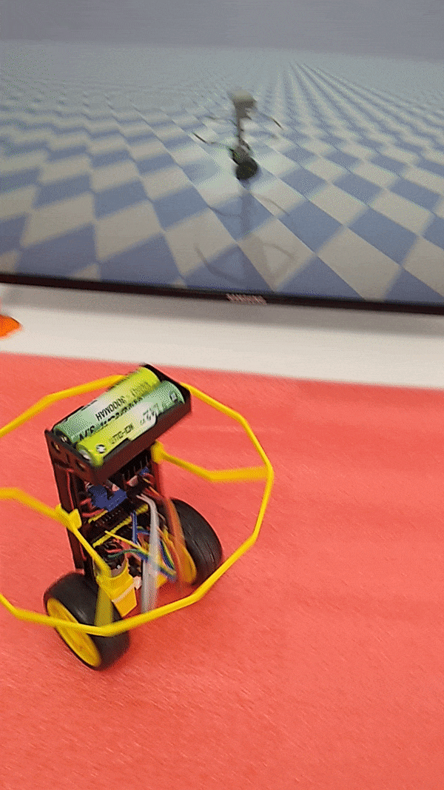
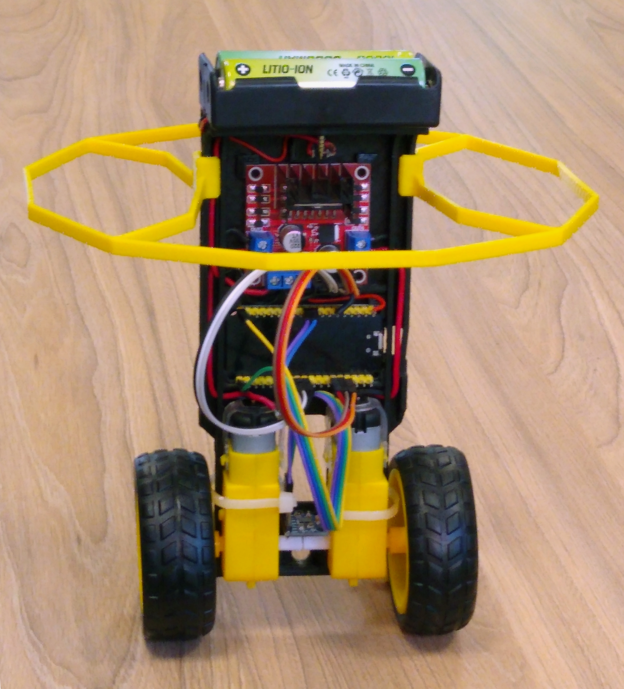
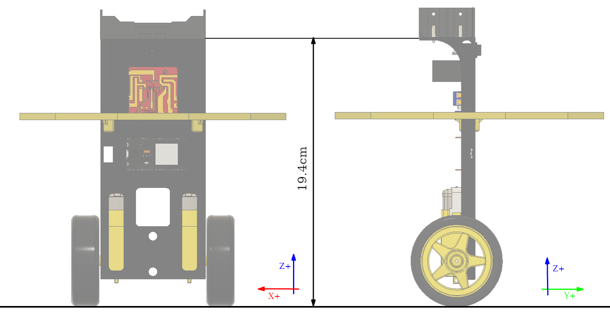
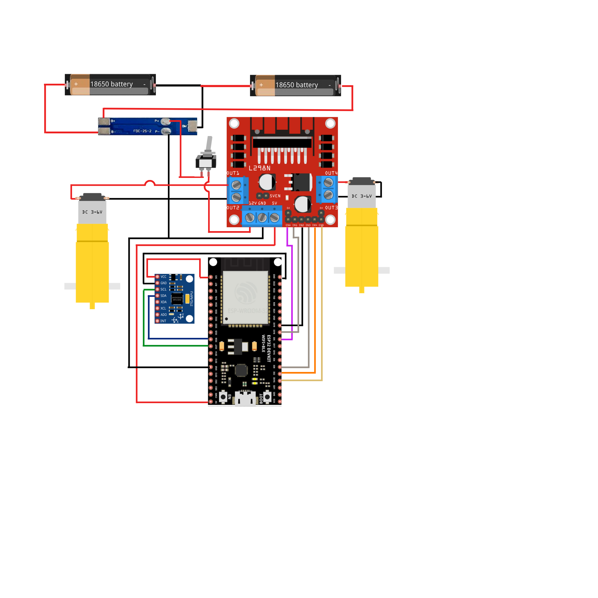
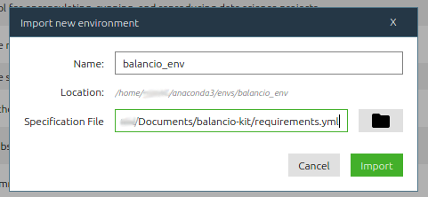

# Balancio-Kit


## Información
    
Proyecto educativo de un robot :robot: de autobalanceo de ultra bajo costo, capaz de correr una red neuronal para mantener el equilibrio y de ser controlado de manera inalámbrica  :trackball:.

Desarrollado con fines didácticos para enseñar conceptos de RL, ML, AI y control.

<p align="center">
    
    
    
</p>

## Versiones

|                      |      Estabilidad      |  Facilidad de Armado  | Requiere I3D | Plano de Impresión 3D|Foto de la versión|
|:--------------------:|:---------------------:|:---------------------:|:------------:|:--------------------:|:----------------:|
| V 0.7 (Recomendado)  | :star: :star: :star:  | :star: :star: :star:  |      SI      |                      ||
|   V 0.6 AKA:Wall-e   | :star: :star: :star:  |         :star:        |      SI      |                      ||
|         V 0.5        |         :star:        | :star: :star: :star:  |      SI      |                      ||

## Ensamblaje :wrench:

El balancio-kit consta de los siguientes componentes:
- Placa base (impresa en 3D o hecha con algún otro material) 
- Microcontrolador NodeMCU ESP32
- IMU MPU 6050
- 2 motorreductores de 6v
- Puente-H L298N
- 2 baterías 18650 con su correspondiente porta-pilas

<p align="center">
    
</p>

## Plano Electrico 
<p align="center">
    
</p>    
    
## Ensamblaje Mecánico 
1. Imprimir en 3D alguna de las [versiones](#versiones).
1. Encastrar piezas en su posición final.
1. Sostener los motores con precintos y/o pegamento. 
1. Conectar los componentes siguiendo el [plano electrico](#plano-electrico).  
   <p align="center">
    
</p>
   
## Instalación :floppy_disk:

En primer lugar, se debe clonar el repositorio. Esto se puede realizar tanto descargando el mismo
como un .ZIP, o ejecutando `git clone https://github.com/UDESA-AI/balancio-kit.git` en consola.

La instalación consta de 3 módulos principales: Microcontrolador, simulación y aplicación.
Éstos son fundamentales para el funcionamiento completo del proyecto, pero la instalación
de cada uno de ellos se puede realizar en distinto orden.
  
  
### Microcontrolador

<details open>
<summary>Instalación de la IDE</summary> 
Para programar y compilar el NodeMCU ESP32 usaremos la IDE de Arduino. Para esto se
debe instalar la misma siguiendo los pasos que se especifican en el siguiente 
[link](https://www.arduino.cc/en/software).
</details> 
<details open>
<summary>Configuración del Microcrontolador</summary> 
Una vez instalada la IDE, se debe habilitar el microcontrolador que vamos a usar.
Para esto se deben seguir los siguientes pasos:
    
1. En la IDE, ir a 'File' (Archivos) → 'Preferences' (Preferencias)
    
2. En el campo "Additional Boards Manager URLs", agregar lo siguiente: https://dl.espressif.com/dl/package_esp32_index.json. (Luego clickear 'OK').
3. Ir a 'Tools' → 'Board: ' → 'Boards Manager…' 
    
4. Buscar "esp32", e instalar "esp32 by Espressif Systems" presionando el botón 'Install'.
    
5. Indicarle a la IDE que vamos a utilizar un esp32. Ir a 'Tools' → 'Board:' → 'ESP32 Arduino' → 'NodeMCU-32S'
    
6. En 'Tools' → 'Port', seleccionar el puerto correspondiente a donde está conectado el microcontrolador.

</details> 

<details open>
<summary>Librerias de Arduino</summary> 
Luego procederemos a instalar las librerías de arduino que vamos a utilizar:
    
   
- Para eso ir a 'Sketch' → 'Include Library' → 'Manage Libraries…'
    
    
- Buscar e instalar las siguientes librerias, especificando la versión correspondiente:
    - MPU6050 by Electronic Cats (version 0.5.0)
    - PS3 Controller Host by Jeffrey van Pernis (version 1.1.0)
    - EloquentTinyML by Simone Salerno (version 0.0.7)
    
    
</details> 
<details open>
<summary>Ejecución inicial</summary> 
Para comprobar la instalación, ejecutaremos un ejemplo de prueba:
- ir a 'File' → 'Examples' → 'WiFi' → 'WiFiScan'
- En el sketch generado, presionar el botón de carga ('Upload')  :calling:
- Si todo funcionó correctamente, debe aparecer un mensaje 'Done uploading' en la consola.

Posibles errores:
- Si no se puede cargar el programa al microcontrolador, intentar mantener presionado el botón "boot" presente en la placa, mientras se realiza la carga. Esto se debería realizar solo la primera vez.
</details> 

### Simulación
<details open>
 
La simulación corre en Python :snake:, y utiliza diversos paquetes. Para facilitar la instalación de los mismos, utilizaremos [Conda](https://docs.conda.io/en/latest/).

Se debe seguir con los siguientes pasos:

1. Para el uso e instalación de conda, descargaremos miniconda (también se puede instalar [Anaconda](https://docs.anaconda.com/anaconda/install/index.html)), siguiendo con los pasos que se especifican en el siguiente [link](https://docs.conda.io/en/latest/miniconda.html#installing).
2. Crearemos un 'Environment' de conda, donde alojaremos nuestros paquetes. 
   Esto se puede realizar tanto desde la consola (en el caso de haber descargado Miniconda) o desde una GUI (en caso de haber descargado Anaconda). Respectivamente:
    - Miniconda: Ejecutar el siguiente comando en la consola: `conda env create -f requirements.yml`. Donde `requierments.yml` es el [archivo](https://github.com/UDESA-AI/balancio-kit/blob/RL_1/requirements.yml) que se encuentra dentro del repositorio y ya fue descargado.
    - Anaconda: En la GUI de Anaconda: En la pestaña environments, hacer clik en import y especificar [archivo](https://github.com/UDESA-AI/balancio-kit/blob/RL_1/requirements.yml) en file

<p align="center">
    
</p>

3. Activar el environment creado, llamado **balancio**:
    - Miniconda: Ejecutar en terminal `conda activate balancio`
    - Anaconda: En la pestaña environments, hacer clik en el ambiente que se quiere activar
4. Dentro del environment activado, ejecutar el archivo [setup.py](https://github.com/UDESA-AI/balancio-kit/blob/RL_1/simulation/balancio_lib/setup.py):
    `python setup.py`
5. Probar la instalación, corriendo el siguiente [script](https://github.com/UDESA-AI/balancio-kit/blob/RL_1/simulation/pid.py):
    `python pid.py`
    </details> 
### Aplicación 


    La aplicación está creada en [MIT App Inventor](https://appinventor.mit.edu/).

Simplemente entrar al website e importar el .aia en `Balancio-kit/app/app.aia`. Luego de esto, se puede usar la aplicación mediante bluethooth desde un celular.


## Calibración


Estas instrucciones asumen conocimiento del uso de la IDE arduino

<details open>
<summary>Calibración del IMU</summary>
1. Abrir `Balancio-kit/Mcu/Src/imu_calibration/imu_calibration.ino` con el IDE Arduino
2. Colocar el robot con la IMU paralela al piso y mantenerlo firme

3. Subir el programa a la placa y usar el monitor serial para obtener las compensaciones de la IMU

4. Modificar las compensaciones en el archivo `balancio-kit/mcu/src/main/config.h` en:
```c++
// IMU calibration parameters
#define X_ACCEL_OFFSET -1775
#define Y_ACCEL_OFFSET  756
#define Z_ACCEL_OFFSET  2706
#define X_GYRO_OFFSET   181
#define Y_GYRO_OFFSET   77
#define Z_GYRO_OFFSET   60
```
</details>  

<details open>
<summary>Calibración del angulo de equilibrio</summary>
1. Abrir `balancio-kit/mcu/src/main/main.ino`

2. Sostener el robot en la posición de equilibrio

3. Subir el programa a la placa y usar el monitor serial para obtener las compensaciones de angulo

4. Modificar en angulo de equilibrio en el archivo `balancio-kit/mcu/src/main/config.h` en la línea:
```c++
// Angle of (approximate) static equilibrium
#define STATIC_ANGLE -0.04 // Calibrated point
```
 </details>   
 
<details open>
<summary>Calibración de las constantes PID</summary>
    
1. Sacar el jumper de 12v en el driver 

2. Elegir parámetros PID
    
3. modificar las constantes del PID en el archivo `balancio-kit/mcu/src/main/config.h` en las líneas:
```c++
// PID Constants for pitch control
#define KP 2000
#define KI 22000
#define KD 20.0
```   

4. Probar las constantes, si se sacó el jumper se puede probar incluso con el cable conectado. **Cuidado al hacer esto!**


---
</details> 
     
Una vez configurado correctamente el robot, se pueden seleccionar distintos parametros de configuracion en el archivo correspondiente (`config.h`). 

Entre ellos, se puede seleccionar el tipo de controlador deseado para estabilizar el Balancio.

Por ejemplo, en caso de querer utilizar un controlador PID:
```c++
// Control algorithm type
#define CONTROL_ALGO "PID"
```

En caso de querer utilzar un agente de aprendizaje por refuerzo:
```c++
// Control algorithm type
#define CONTROL_ALGO "RL"
```
</details> 

---
## TODO

- [x] initial commit
- [x] Desarrollar aplicación bluetooth
- [x] Crear agente RL
- [x] Diseño mecánico
- [ ] Publicar STEP del diseño mecánico
- [ ] Crear diagrama electrónico

    
## Bugs conocidos
- Wheel spins on sturtup


    
## Contribuciones
 
Las *pull requests* son bienvenidas, para cambios mayores, por favor abrir un *issue* para discutir los cambios deseados

## Licencia
[MIT](https://choosealicense.com/licenses/mit/)
