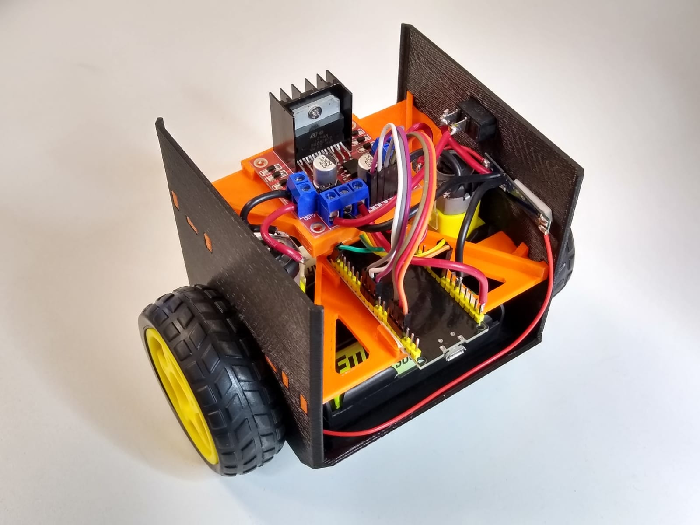
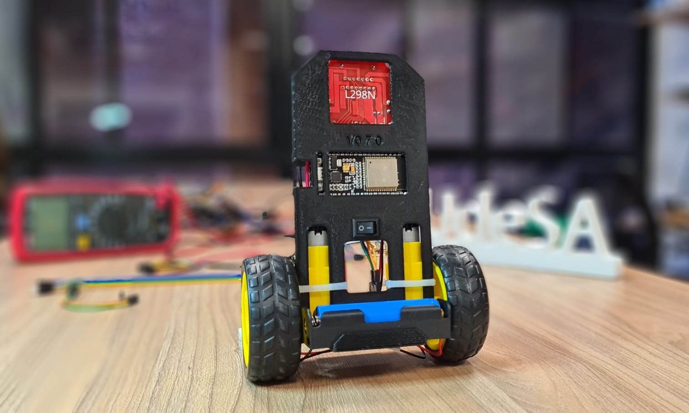
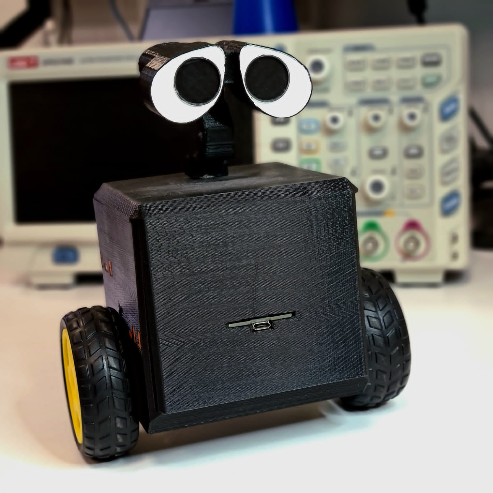
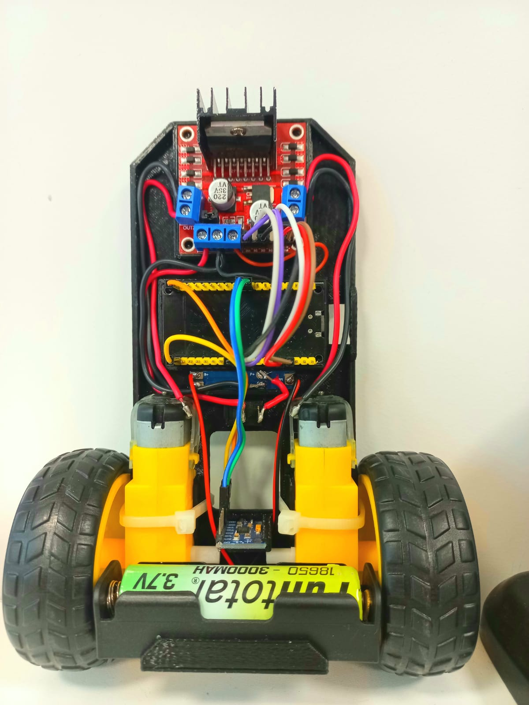
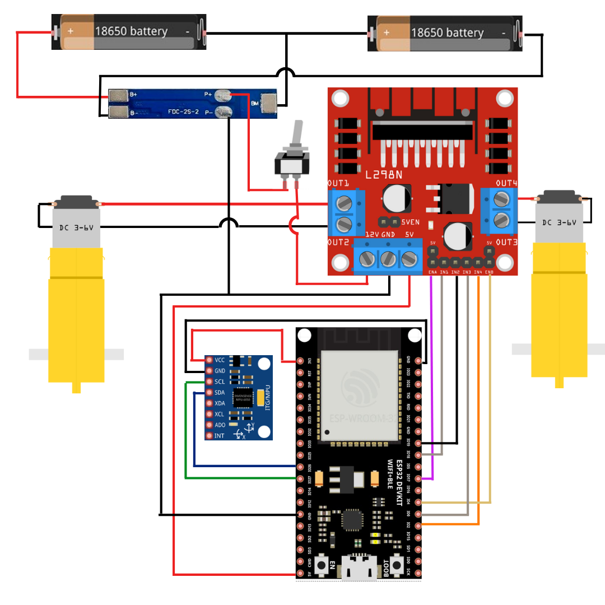

# Balancio-Kit


## Presentation
 
Educational project of an ultra-low-cost self-balancing robot :robot:, capable of running a neural network to maintain balance and being controlled wirelessly :trackball:.
Developed for educational purposes to teach RL, ML, AI and control concepts.
 

<p align="center">
    
    
    
    
    
    
</p>


## Models 
|                     | Stabilty         | easy assembly  | 3D P  Requiered | 3DP time (#configuración-de-impresión)|  3D printing diagram | model image                                 |
|:-------------------:|:--------------------:|:--------------------:|--------------|:----------------------------------------------------------------------------------------------------------------------------------------------------------------------------------------------------:|:--------------------------------------------------------------------------------------------------------------------------------------:|:--------------------------------------------------:|
| V 0.7 (recommended) | :star: :star: :star: | :star: :star: :star: | SI           | <ul style="list-style-type:none;"> <li>  Batteries 47m </li> <li> structure 2:36 h </li> </ul>                                                                                                       | <A HREF="https://github.com/AaronLoz/balancio-kit/tree/RL_1/Planos%20de%20Impresi%C3%B3n%203D/Version%200.7"> Versión 0.7 I3D</A>      |  |
| V 0.6 AKA:Wall-e    | :star: :star: :star: | :star:               | SI           | <ul style="list-style-type:none;"> <li> underside 5:25h </li> <li> Upperside 5:11h </li> <li> under structure 58m</li> <li>Upper Structure 55m</li> <li> Head 3:19 h </li> </ul> | <A HREF="https://github.com/AaronLoz/balancio-kit/tree/RL_1/Planos%20de%20Impresi%C3%B3n%203D/Versi%C3%B3n%200.6"> Versión 0.6 I3D</A> |   |
| V 0.5               | :star:               | :star: :star: :star: | SI           |<ul> <li> Rim 49m </li> <li> Structure 4:42h </li>                                                                                                                                                                            | <A HREF="https://github.com/AaronLoz/balancio-kit/tree/RL_1/Planos%20de%20Impresi%C3%B3n%203D/versi%C3%B3n%200.5"> Versión 0.5 I3D</A> |     |
    
### Printing setting

- nozzle thickness : 0.4 mm
- layer height : 0.3 mm 
- Perimeter: 3 
- Top and Bottom Solid Layer:  3 
- Infill: 20%

## Assembly :wrench:

The balance-kit has the following components:
- Structure (3D printed or made of some other material) 
- Node MCU ESP32 microcontroller
- IMU MPU 6050
- 2 6v geared motors
- L298N H-Bridge
- 2 x 18650 batteries with corresponding battery holder
- BMS FCD-2S-2
- Switch 


<p align="center">
    
</p>

## Electrical Drawing 
<p align="center">
    
</p>    
    
## Mechanical Assembly

1. 3D print any of the [models](#models).
1. Fit parts in their final position.
1. Hold the motors in place with seals and/or glue. 
1. Connect the components following the [electrical drawing](#electrical-drawing). 


     
## Installation :floppy_disk:
 
First, the repository must be cloned. This can be done either by downloading the
as a .ZIP, or by running `git clone https://github.com/UDESA-AI/balancio-kit.git` in console.

The installation has 3 main modules: Microcontroller, simulation and application.
These are fundamental for the complete functioning of the project, but the installation 
of each of them can be done in different order.
  
  
### Microcontrolador

<details open>
<summary>Instalación de la IDE</summary> 
Para programar y compilar el NodeMCU ESP32 usaremos la IDE de Arduino. Para esto se
debe instalar la misma siguiendo los pasos que se especifican en el siguiente 
[link](https://www.arduino.cc/en/software).
</details> 
<details open>
<summary>Configuración del Microcrontolador</summary> 
Una vez instalada la IDE, se debe habilitar el microcontrolador que vamos a usar.
Para esto se deben seguir los siguientes pasos:
    
    
    
 ### Microcontroller

<details open>
<summary>Installing the IDE</summary> 
To program and compile the ESP32 NodeMCU we will use the Arduino IDE. To do this 
must be installed by following the steps specified in the following [link](https://www.arduino.cc/en/software).

</details> 
<details open>
<summary>Microcontroller Setting</summary> 
Once the IDE is installed, the microcontroller we are going to use must be enabled.
To do this, the following steps must be followed:
     
1. In the IDE, go to 'File' → 'Preferences'.
    
2. In the "Additional Boards Manager URLs" field, add the following: https://dl.espressif.com/dl/package_esp32_index.json. (Then click 'OK').
3. Go to 'Tools' → 'Board: ' → 'Boards Manager...'. 
    
4. Search for "esp32", and install "esp32 by Espressif Systems" by pressing the 'Install' button.
    
5. Indicate the IDE that we are going to use an esp32. Go to 'Tools' → 'Board:' → 'ESP32 Arduino' → 'NodeMCU-32S'.
    
6. In 'Tools' → 'Port', select the port corresponding to where the microcontroller is connected.

</details> 

<details open>
<summary>Arduino Libraries</summary> 
We will then proceed to install the arduino libraries we are going to use:
    
   
- For that go to 'Sketch' → 'Include Library' → 'Manage Libraries...'.
    
- Search for and install the following libraries, specifying the corresponding version:
    - MPU6050 by Electronic Cats (version 0.5.0)
    - PS3 Controller Host by Jeffrey van Pernis (version 1.1.0)
    - EloquentTinyML by Simone Salerno (version 0.0.7)
    
</details> 
<details open>
<summary>Initial run</summary>. 
To test the installation, we will run a test example:
- go to 'File' → 'Examples' → 'WiFi' → 'WiFiScan'.
- In the generated sketch, press the 'Upload' button :calling:
- If everything worked correctly, you should see a 'Done uploading' message in the console.


Possible errors:
- If the program cannot be uploaded to the microcontroller, try to hold down the "boot" button present on the board, while uploading. This should only be done the first time.
</details> 

### Simulation
<details open>
 
The simulation runs in Python :snake:, and uses several packages. For ease of installation, we will use [Conda](https://docs.conda.io/en/latest/).

The following steps must be followed:

1. To use and install conda, download miniconda (you can also install [Anaconda](https://docs.anaconda.com/anaconda/install/index.html)), following the steps specified in the following [link](https://docs.conda.io/en/latest/miniconda.html#installing).
2. We will create a conda environment, where we will host our packages. 
   This can be done either from the console (in case you have downloaded Miniconda) or from a GUI (in case you have downloaded Anaconda). Respectively:
    - Miniconda: Execute the following command in the console: `conda env create -f requirements.yml`. Where `requirements.yml` is the [file](https://github.com/UDESA-AI/balancio-kit/blob/RL_1/requirements.yml) found inside the repository and already downloaded.
    - Anaconda: In the Anaconda GUI: In the environments tab, click on import and specify [file](https://github.com/UDESA-AI/balancio-kit/blob/RL_1/requirements.yml) in file.

<p align="center">
    
</p>

3. Activate the created environment, called **balance**:
    - Miniconda: Execute in terminal `conda activate balancio`.
    - Anaconda: In the environments tab, click on the environment you want to activate.
4. In the activated environment, execute the file [setup.py](https://github.com/UDESA-AI/balancio-kit/blob/RL_1/simulation/balancio_lib/setup.py):
    `python setup.py`
5. Test the installation by running the following [script](https://github.com/UDESA-AI/balancio-kit/blob/RL_1/simulation/pid.py):
    `python pid.py`
    </details> 

### Physical Variables of version 0.7
 
#### Structure
Mass without wheels: 0.244 kg

Position of the centre of mass relative to the axis of the engines and the symmetrical centre of the body: 


- x = 1.55 
- y ~= 0 mm
- z = 31 mm

Inertia without wheels from centre of mass (kg.m2): 

- Ixx = 0.0006945
- Ixy ~= 0
- Iyy = 0.0006536
- Ixz = -0.000013447 
- Iyz ~= 0
- Izz = 0.0001937

#### Wheel
Mass of a wheel: 0.029 kg

Position of the centre of mass relative to the axis of the engines and the edge of the grip: 
- x = 0 mm   
- y = 15.6 mm 
- z = 0 mm


Inertia of the wheel from the centre of mass (kg.m2):  

- Ixx = 0.000011729 
- Ixy ~= 0  
- Iyy = 0.000021531 
- Ixz ~= 0 
- Iyz ~= 0 
- Izz = 0.000011729


### Application

 The application is created in <A HREF="https://appinventor.mit.edu/"> MIT App Inventor </A>.

Simply go to the website and import the .aia en <A HREF="Balancio-kit/app/app.aia"> App Balancio </A>. After that, the application can be used via bluethooth from a mobile phone.

## Calibration


These instructions assume knowledge of using the arduino IDE.

<details open>
<summary> IMU  Calibration </summary>
1. Open `Balancio-kit/Mcu/Src/imu_calibration/imu_calibration.ino` with the Arduino IDE.
2. Place the robot with the IMU parallel to the floor and hold it steady.

3. Upload the program to the board and use the serial monitor to get the offsets from the IMU.

4. Modify the offsets in the `balancio-kit/mcu/src/main/config.h` file in:
```c++

// IMU calibration parameters
#define X_ACCEL_OFFSET -1775
#define Y_ACCEL_OFFSET  756
#define Z_ACCEL_OFFSET  2706
#define X_GYRO_OFFSET   181
#define Y_GYRO_OFFSET   77
#define Z_GYRO_OFFSET   60
```
</details>  

<details open>
<summary>Calibration of the balance angle</summary>.
1. Open `balancio-kit/mcu/src/main/main.ino`.

2. Hold the robot in the equilibrium position.

3. Upload the program to the board and use the serial monitor to obtain the angle offsets.

4. Modify the balance angle in the `balancio-kit/mcu/src/main/config.h` file on the line:
```c++
// Angle of (approximate) static equilibrium
#define STATIC_ANGLE -0.04 // Calibrated point
```
 </details>   
 
<details open>
<summary>Calibrating the PID constants</summary> 1.
    
1. Remove the 12v jumper on the driver. 

2. Select PID parameters
    
3. modify the PID constants in the `balancio-kit/mcu/src/main/config.h` file on the lines:
```c++
// PID Constants for pitch control
#define KP 2000
#define KI 22000
#define KD 20.0
```   

4. Test the constants, if the jumper was removed you can test even with the cable connected. **Be careful when doing this!


---
</details> 
     
Once the robot has been correctly configured, various configuration parameters can be selected in the corresponding file (`config.h`). 

Among them, you can select the type of controller you want to use to stabilise the Balancio.

For example, in case you want to use a PID controller:
```c++
// Control algorithm type
#define CONTROL_ALGO "PID".
```

In case you want to use a reinforcement learning agent:
```c++
// Control algorithm type
#define CONTROL_ALGO "RL"
```
</details> 

---
## Overview

- [x] initial commit
- [x] Develop bluetooth application
- [x] Create RL agent
- [x] Mechanical design
- [X] Publish STL of mechanical design
- [ ] Publish STEP of mechanical design
- [X] Create electronic diagram
- [ ] Clarify which data to lift from imu calibration.


    
## Known  Bugs 
- [x] Wheel spins on startup


    
## Contributions
 
Pull requests are welcome, for major changes, please open a *issue* to discuss the desired changes.

## Licency
[MIT](https://choosealicense.com/licenses/mit/)
